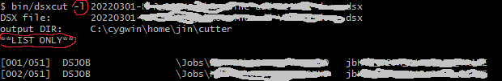

# DSXCUT

## Features
* Cut single .dsx taht contains multiple DS components into one-component-per-file .dsx file. 
* Single static binary for Linux/Windows.
* Directory tree is built base on compoennt hirachy in DataStage on "splitting".
* List component name, type.
* quiet mode.
* Stand alone utility. Datastage API/library is not used.
 
## Description:
 This utility takes DSX file as input. The DSX file is generated from DS Designer through "export" command.
 This utility search component (job, routine and etc) and write each component into an individual file.
 File name of the output file is same as the component name, with ".dsx" as file name extension.
 Output file always in a subfolder according its folder/hireachy in DS Designer. 

 Optionaly, lists the component's name, type and hierachy without write to file, by option **-l**.  
 Optionally, no output to screen. By option **-q**  
 Optionally, specify the 'base' folder of the output .dxs file tree. By option **-o**  
### output samples
 Split one .dsx file to one-component-per-file .dsx files.


 List only the type and object in a .dsx file:


### Filter (Developer option, hard-coded in source code)
 Filter of component is applied in processing. In the code, only following type of object are processed:
 *   Job, parallel and sequence
 *   Parameter set
 *   Routine

 *   Transform (not tested)
 *   Stage Type (not tested)
 *   Share Container (not tested)

 Types that been commentted out in source code.
 *   Data Type
 *   Table Definition
 
  These are fixed at compile time. 
 
####  Component types to be includeed in future
  Some types can be added in future: (add entries to `comp_types` structure, see source for details)
 *    transform (DS Designer advanced design)
 *    shareContainer (DS Designer advanced design)
 &nbsp;
 *   matchSpecification (analys/profile)
 &nbsp;
 *    dataElement (admin level, engine feature)
 *    machineProfile (admin level, engine feature)
 *    MNSRules (admin level, engine feature)
 *    stageType (admin level, engine feature)
 *    standardizationRules (admin level, engine feature)
 *    tableDefinition (design phase only, not needed in compile time, EXCLUDED EXPLICATLY)

 ## Usage:
```
  	C:\cygwin64\home\jin\py\cutter>dsxcut
  	Error: input file must be provided!

  	Usage:
  	    dsxcut <.dsx file> [-lqhoc] [-o outdir]

 
  	Allowed options:
  	  -f [ --file ] arg        REQUIED. Input .dsx file
  	  -l [ --list ]            List components only (No write)
  	  -q [ --quiet ]           Suppress output(quiet)
  	  -o [ --outdir ] arg (=.) Output dir (Default: current working directory)
  	  -h [ --help ]            This help msg
 
 
  	C:\cygwin64\home\jin\py\cutter>
```
 *Return Code:*  
  	&nbsp;&nbsp;&nbsp; 0: 	success  
  	&nbsp;&nbsp;&nbsp; non-0:	error

---

## Distribution
 Only executable file itself, dsxcut.exe (windows) or dsxcut (Linux) is needed for distribution.
 No environment variable is used/needed.

 See "Compatibility" session for compatibility troubleshooting/workaround.


## Build from source
### with Windows (MingW through Cygwin)
  In Cygwin environment
 *  Install libmingW, gcc 4.8.5(stdc++11) or higher and libboost(dev) 1.66.0+.
 *  Build:

 ``` bash
  		jin@host ~/py/cutter
  		$ time cat ct.cpp | /usr/bin/i686-w64-mingw32-g++ -O2 --std=c++11 -g -xc++ - -L/usr/i686-w64-mingw32/sys-root/mingw/lib  -l:libboost_system.a -l:libboost_filesystem.a -l:libboost_regex.a -l:libboost_program_options.a -l:libstdc++.a -l:libpthread.a -static-libgcc -static-libstdc++ -static -o dsxcut 
```

Optionally, install libboost source (needed for Linux only, if no root/admin permission is available), build and link with main program as practice for Linux environment building process.
 
### with Linux
 Minimum installation: gcc 4.8.5

#### LibBoost build from source
In a seperate folder:
 * Download Boost source package v1.66.0 from  [boost official site] (https://boostorg.jfrog.io/artifactory/main/release/1.66.0/source/boost_1_66_0.tar.bz2)
 * Extract to seperate folder (It takes about 600MB space)
 * Configure it with command 
 ```
  		./bootstrap.sh
 ``` 	
 * Build component with:
 ```
  		./b2 stage --with-regex --with-filesystem --with-system address-model=64 -d+2 -j6
 ```
 The built library files are in folder ./stage .
 
####   dsxcut:
 Build, use same command line in mingW, with proper **-L** path replaced with boost built in first step (under **boost/.../stage folder**) from.
 
## Compatibility:
 
  * Windows. 
	Could be any. Tested on Windows 10.
 
  * Linux: Under Linux, there are glibc version dependency, since gcc is chosen.  
   	Though all Linux has glibc runtime environment installed by default. 
   		
   	Not all versions provides 100% backward compabiblity to the glibc version used for linking.     		
	The workaround is to build with "oldest" system you can find and distribute the executable to "newer" systems.
   		This is based on glibc backward compatibility. For details, check [] (https://abi-laboratory.pro/?view=timeline&l=glibc)
